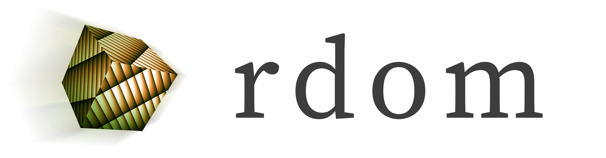

DOM in Rust without a browser
===

Hello and welcome. This library provides server-side or browserless simulation of a DOM.

[](https://docs.rs/rdom/latest/rdom/)
[](https://github.com/philip-peterson/rust-rdom/actions/workflows/ci.yml?query=branch%3Amaster)
[](https://discord.gg/a6AWa35Sj8)

Example Usage
---

```rust
use std::sync::Arc;

use rdom::config::ScreenMetrics;
use rdom::sandbox::Sandbox;
use rdom::node::element::{HtmlHtmlElement, HtmlBodyElement};
use rdom::node::AnyNode;

fn main() {
    let metrics: ScreenMetrics = Default::default();
    let sbox = Sandbox::new(metrics);
    let doc = sbox.clone().window().document();
    let document_element = HtmlHtmlElement::new(Arc::downgrade(&sbox), ());
    doc.append_child(document_element);

    // We don't use the text node, but those are available
    let _text = doc.create_text_node("Hello, world!".to_string());

    println!("Doc has {} child node(s)", doc.child_nodes().length());
    // Prints out Doc has 1 child node(s)
}
```

Is this library ready yet?
----
No, it's still a pre-alpha work in progress. However, it is open to collaboration.

What's the difference between this library and say, web-sys or Dodrio?
-----
Rdom tries to behave like web-sys as much as possible, in that it provides a DOM
that looks and acts a lot like a DOM as a Rust programmer would see a DOM via interaction
with web-sys.

The key difference is that there is no actual browser. I mean, you could have one, but it's not
required.

Additionally, this library supports the concept of multiple sandboxes, so not all nodes belong
to one big node pool like in web-sys. Instead, each sandbox contains a single document tree and
some information about the window (like width and height).

Compared to Dodrio, this library is focused much more on the actual DOM element types. Dodrio
is basically agnostic to what different types of tags are, and is more focused on the question
of how to manipulate a DOM to match some ideal, like React's virtual DOM does. If that's still
unclear, Dodrio targets web-sys as a backend (it's a dependency), and in theory, this library
could also be a backend for Dodrio someday.

Not all of the DOM has been implemented. How did you decide what parts to implement?
----

The reason for developing this library was to enable SSR support for Yew. That was the entire
purpose, so while it is built to be as versatile as reasonable, that is the main use case that
we are serving right now, although applications to become a maintainer are certainly welcome.
